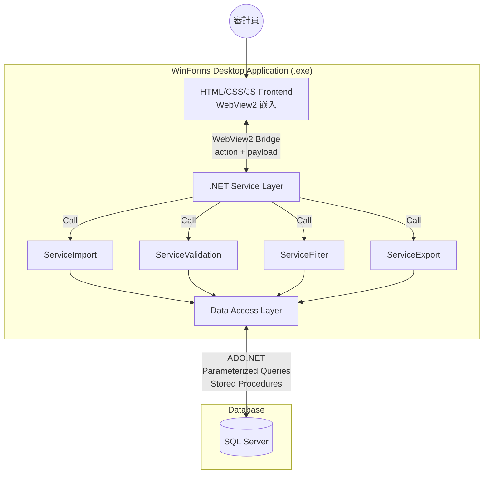

# 系統架構設計 (System Architecture)

## 設計理念

本專案從早期的 VBA + Access 技術棧，遷移至 **C# + .NET 10 LTS + WinForms + WebView2 + SQL Server** 架構。核心目標是建立一個可中心化管理、能處理大量 GL/TB、可由審計員靈活設定篩選條件的 JET 系統，同時最大化 AI 輔助開發效能。

> VBA 版本的架構設計已歸檔至 `legacy/docs/architecture-vba.md`，供歷史參考。

---

## 架構總覽

```
┌───────────────────────────────────────────────────┐
│                  WinForms Host (.exe)              │
│  ┌─────────────────────────────────────────────┐  │
│  │              WebView2 Runtime                │  │
│  │  ┌───────────────────────────────────────┐  │  │
│  │  │      HTML / CSS / JS Frontend         │  │  │
│  │  │  (AI-generated UI components)         │  │  │
│  │  └──────────────┬────────────────────────┘  │  │
│  └─────────────────┼───────────────────────────┘  │
│                    │ WebView2 Bridge               │
│  ┌─────────────────┼───────────────────────────┐  │
│  │         .NET Service Layer (C#)             │  │
│  │  ┌──────┐ ┌──────────┐ ┌──────────────┐   │  │
│  │  │Import│ │Validation│ │Filter/Export  │   │  │
│  │  └──┬───┘ └────┬─────┘ └──────┬───────┘   │  │
│  │     └──────────┼──────────────┘            │  │
│  │                │ Data Access Layer          │  │
│  └────────────────┼───────────────────────────┘  │
└───────────────────┼───────────────────────────────┘
                    │ ADO.NET / Stored Procedures
              ┌─────┴─────┐
              │ SQL Server │
              │  (ETL,     │
              │   Rules,   │
              │   Results) │
              └────────────┘
```

---

## 架構圖 (Mermaid)



---

## 層級職責

### 1. Frontend — HTML/CSS/JS (WebView2 嵌入)

- **職責**: 純 UI 層，不含業務邏輯
- **負責項目**:
  - 拖曳 / 點擊上傳 GL、TB 檔案
  - 日期選擇器、條件輸入表單
  - 動態篩選器面板
  - 表格結果預覽
  - 工作流程步驟 UI
- **與後端通訊**: 透過 WebView2 Bridge 發送 `action + payload`，接收結構化結果
- **優勢**: AI 最擅長生成 HTML/CSS/JS 前端，可快速迭代

### 2. WinForms Host

- **職責**: 桌面應用程式外殼
- **負責項目**:
  - 管理 WebView2 控件生命週期
  - 註冊 Bridge methods 供前端呼叫
  - 打包為單一 `.exe` 發行
  - 處理系統層級事件 (檔案對話框、視窗管理)
- **設計原則**: Host 層盡量薄，主要作為容器

### 3. .NET Service Layer (C#)

- **職責**: 核心業務邏輯與流程控制
- **負責項目**:
  - 接收前端的 action + payload
  - 驗證參數合法性
  - 協調業務流程 (匯入 → 驗證 → 篩選 → 匯出)
  - 呼叫 Data Access Layer 執行資料庫操作
  - 整理結果回傳前端
- **關鍵模組**:
  - `ServiceImport` — GL/TB 檔案解析、欄位映射、資料匯入
  - `ServiceValidation` — 完整性測試、借貸平衡、INF 抽樣、空值檢查
  - `ServiceFilter` — 預篩選程序 (R1-R8, A2-A4)、進階篩選、科目配對分析
  - `ServiceExport` — 工作底稿產出、Excel 匯出

### 4. Data Access Layer

- **職責**: 資料庫存取封裝
- **負責項目**:
  - ADO.NET 連線管理
  - 參數化查詢 (防止 SQL Injection)
  - Stored Procedure 呼叫
  - Transaction 管理
  - 結果集映射

### 5. SQL Server

- **職責**: 資料儲存與大量運算引擎
- **負責項目**:
  - GL/TB 資料儲存 (支援數千至數千萬筆)
  - ETL (Extract, Transform, Load)
  - 標準化 Schema (Staging → Target)
  - Stored Procedures (規則引擎、篩選邏輯)
  - Views (彙總報表)
  - Rule Tables (篩選規則定義)
  - 結果表 (篩選結果暫存)

---

## 重要架構原則

### 前端不拼 Raw SQL

```
✗ 錯誤: 前端組 SQL 字串 → 直接送 SQL Server
✓ 正確: 前端送 action + payload → .NET 驗證 → 參數化查詢 / Stored Procedure → SQL Server
```

### 關注點分離 (Separation of Concerns)

| 層級 | 知道什麼 | 不知道什麼 |
|:---|:---|:---|
| HTML Frontend | UI 如何呈現、使用者操作 | SQL、資料庫結構、業務規則細節 |
| WinForms Host | WebView2 控件管理 | 業務邏輯、資料庫 |
| Service Layer | 業務流程、參數驗證、規則定義 | UI 如何呈現 |
| Data Access | SQL 語法、連線管理 | 業務規則的語意 |
| SQL Server | 資料儲存、查詢最佳化 | 使用者操作、UI |

---

## 資料流

### 匯入流程

```
使用者拖曳 GL.xlsx
  → HTML Frontend (上傳 UI)
  → WebView2 Bridge: { action: "import", payload: { type: "GL", file: ... } }
  → .NET ServiceImport: 解析欄位、驗證格式
  → Data Access: 參數化 INSERT
  → SQL Server: Staging Table → ETL → Target Table
  → .NET: 回傳匯入結果統計
  → HTML Frontend: 顯示結果
```

### 篩選流程

```
使用者選擇篩選條件 (R1, R3, 金額 > 100,000)
  → HTML Frontend (條件表單)
  → WebView2 Bridge: { action: "filter", payload: { rules: ["R1","R3"], amount_min: 100000 } }
  → .NET ServiceFilter: 驗證參數、組合條件
  → Data Access: 呼叫 Stored Procedure (sp_ExecutePreScreening)
  → SQL Server: 執行篩選、寫入結果表
  → .NET: 讀取結果、格式化
  → HTML Frontend: 表格預覽
```

---

## 技術選型

| 項目 | 技術 | 原因 |
|:---|:---|:---|
| 語言 | C# | 社群資源最豐富、AI 生成品質最佳、現代 .NET 生態主流 |
| 執行時 | .NET 10 LTS | 支援 `dotnet build/test`、現代 CLI/AI agent workflow |
| 桌面 Host | WinForms | Phase 1 最務實、輕量、適合 data-driven 應用 |
| UI 嵌入 | WebView2 | Windows 本機已有 Runtime、HTML 前端由 AI 快速生成 |
| 前端 | HTML/CSS/JS | AI 最擅長生成、快速迭代、豐富的 UI 元件 |
| 資料庫 | SQL Server | 大量資料處理、ETL、Stored Procedures、權限管理 |
| IDE | Visual Studio 2026 | GitHub Copilot Agent Mode 深度整合 |
| AI 輔助 | GitHub Copilot Agent Mode | 讀 repo、改檔、build、test、自動修正 |

---

## 部署方式

- 打包為單一 `.exe` (self-contained deployment)
- 不架設 web server
- 使用者直接執行，無需安裝額外依賴
- SQL Server 連線字串於應用內設定
- WebView2 Runtime 依賴 Windows 內建版本

---

## 歷史架構演進

| 階段 | 技術棧 | 狀態 |
|:---|:---|:---|
| Phase 0 | Caseware IDEA + IDEAScript | 已棄用 (不再訂閱 IDEA) |
| Phase 1 | Excel VBA + Access Database (MVP) | 已歸檔至 `legacy/` |
| Phase 2 | C# + .NET 10 + WinForms + WebView2 + SQL Server | **當前方向** |
