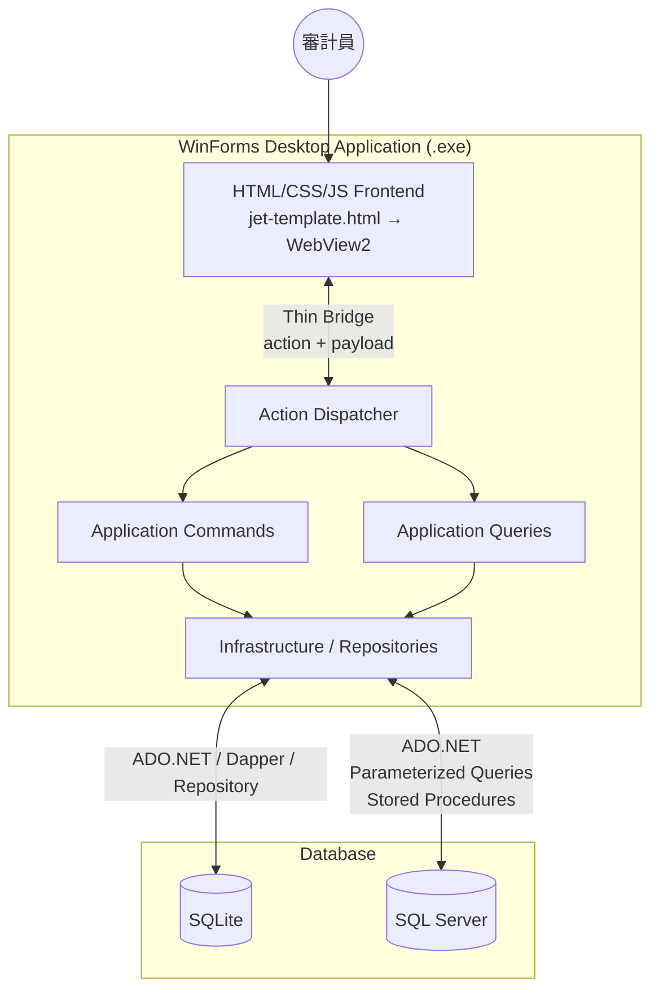

# 系統架構設計 (System Architecture)

## 設計理念

本專案從早期的 VBA + Access 技術棧，遷移至 **C# + .NET 10 + WinForms + WebView2 + HTML + SQLite + SQL Server** 架構。核心目標是建立一個可中心化管理、能處理大量 GL/TB、可由審計員靈活設定篩選條件的 JET 系統，同時最大化 AI 輔助開發效能。

目前已明確定案的系統分層模式為：

- **Thin-Bridge Action-Dispatcher**
- **Application CQRS (Command Query Responsibility Segregation)**
- **SQLite + SQL Server 雙資料策略**
- **`docs/jet-template.html` 作為前端目標模板**

> VBA 版本的架構設計已歸檔至 `legacy/docs/architecture-vba.md`，供歷史參考。

---

## 架構總覽

```text
┌──────────────────────────────────────────────────────────────┐
│                    WinForms Host (.exe)                     │
│  ┌──────────────────────────────────────────────────────┐    │
│  │                    WebView2 Runtime                  │    │
│  │  ┌────────────────────────────────────────────────┐  │    │
│  │  │         HTML / CSS / JS Frontend              │  │    │
│  │  │      (based on jet-template.html)             │  │    │
│  │  └──────────────────────┬────────────────────────┘  │    │
│  └─────────────────────────┼───────────────────────────┘    │
│                            │                                │
│               Thin Bridge / Action Dispatcher               │
│                            │                                │
│        ┌───────────────────┴────────────────────┐           │
│        │         Application Layer (CQRS)       │           │
│        │ Commands / Queries / DTOs / Policies   │           │
│        └───────────────────┬────────────────────┘           │
│                            │                                │
│              Infrastructure / Repositories                  │
└──────────────────────┬───────────────────────┬──────────────┘
                       │                       │
                 ┌─────┴─────┐           ┌─────┴─────┐
                 │  SQLite   │           │ SQL Server │
                 │ local app │           │ heavy data │
                 │ state     │           │ and rules  │
                 └───────────┘           └────────────┘
```

---

## 架構圖 (Mermaid)



---

## 層級職責

### 1. Frontend — HTML/CSS/JS (WebView2 嵌入)

- **職責**: 純 UI 層，不含業務邏輯
- **負責項目**:
  - 拖曳 / 點擊上傳 GL、TB 檔案
  - 日期選擇器、條件輸入表單
  - 動態篩選器面板
  - 表格結果預覽
  - 工作流程步驟 UI
- **與後端通訊**: 透過 WebView2 Bridge 發送 `action + payload`，接收結構化結果
- **優勢**: AI 最擅長生成 HTML/CSS/JS 前端，可快速迭代

### 2. WinForms Host

- **職責**: 桌面應用程式外殼
- **負責項目**:
  - 管理 WebView2 控件生命週期
  - 註冊 Bridge methods 供前端呼叫
  - 打包為單一 `.exe` 發行
  - 處理系統層級事件 (檔案對話框、視窗管理)
- **設計原則**: Host 層盡量薄，主要作為容器；不在 `Form1` 內堆疊業務規則

### 3. Thin Bridge / Action Dispatcher

- **職責**: 將前端固定綁定元素轉成後端可處理的 `action + payload`
- **負責項目**:
  - 接收 WebView2 訊息
  - 解析 `requestId`、`action`、`payload`
  - 將請求分派到對應 handler
  - 統一回傳成功/失敗結果
- **設計原則**: Bridge 不實作業務邏輯，只負責轉送與協定穩定性

### 4. Application Layer (CQRS)

- **職責**: 核心業務邏輯與流程控制
- **負責項目**:
  - 接收 dispatcher 轉送的 action + payload
  - 驗證參數合法性
  - 協調業務流程 (匯入 → 驗證 → 篩選 → 匯出)
  - 呼叫 Infrastructure 層執行資料存取與外部操作
  - 整理結果回傳前端
- **關鍵模組**:
  - `Commands` — 匯入、驗證、篩選、匯出、設定儲存
  - `Queries` — 狀態查詢、預覽資料、結果彙總、工作底稿檢視
  - `Contracts` / `DTOs` — 前後端與應用層之間的資料契約

### 5. Infrastructure Layer

- **職責**: 資料庫存取與外部資源操作封裝
- **負責項目**:
  - ADO.NET 連線管理
  - 參數化查詢 (防止 SQL Injection)
  - Stored Procedure 呼叫
  - Transaction 管理
  - 結果集映射
  - Excel / CSV 讀寫
  - 本機檔案、快取、工作目錄管理

### 6. SQLite + SQL Server

| 儲存體 | 角色 | 適用內容 |
|:---|:---|:---|
| SQLite | 本機狀態庫 | 專案設定、欄位映射、前端狀態、暫存結果、離線開發資料 |
| SQL Server | 正式運算庫 | 大量 GL/TB、規則引擎、彙總查詢、正式結果表 |

#### SQL Server

- **職責**: 資料儲存與大量運算引擎
- **負責項目**:
  - GL/TB 資料儲存 (支援數千至數千萬筆)
  - ETL (Extract, Transform, Load)
  - 標準化 Schema (Staging → Target)
  - Stored Procedures (規則引擎、篩選邏輯)
  - Views (彙總報表)
  - Rule Tables (篩選規則定義)
  - 結果表 (篩選結果暫存)

---

## 重要架構原則

### 前端不拼 Raw SQL

```
✗ 錯誤: 前端組 SQL 字串 → 直接送 SQL Server
✓ 正確: 前端送 action + payload → .NET 驗證 → 參數化查詢 / Stored Procedure → SQL Server
```

### 關注點分離 (Separation of Concerns)

| 層級 | 知道什麼 | 不知道什麼 |
|:---|:---|:---|
| HTML Frontend | UI 如何呈現、使用者操作 | SQL、資料庫結構、業務規則細節 |
| WinForms Host | WebView2 控件管理 | 業務邏輯、資料庫 |
| Thin Bridge / Dispatcher | action 契約、訊息轉送、錯誤包裝 | 審計規則與查詢細節 |
| Application Layer | 業務流程、參數驗證、規則定義 | UI 如何呈現 |
| Infrastructure | 連線管理、查詢與檔案操作 | 業務規則的語意 |
| SQLite / SQL Server | 資料儲存、查詢最佳化 | 使用者操作、UI |

---

## 資料流

### 匯入流程

```
使用者拖曳 GL.xlsx
  → HTML Frontend (上傳 UI)
  → Thin Bridge: { action: "import.gl", payload: { file: ... } }
  → Action Dispatcher → Import Command Handler
  → Infrastructure: 檔案解析 + Repository 寫入
  → SQLite / SQL Server: 狀態更新 + 資料落地
  → .NET: 回傳匯入結果統計
  → HTML Frontend: 顯示結果
```

### 篩選流程

```
使用者選擇篩選條件 (R1, R3, 金額 > 100,000)
  → HTML Frontend (條件表單)
  → Thin Bridge: { action: "query.filter.preview", payload: { rules: ["R1","R3"], amount_min: 100000 } }
  → Action Dispatcher → Filter Query Handler
  → Infrastructure: 呼叫 Repository / Stored Procedure
  → SQL Server: 執行篩選、寫入結果表
  → .NET: 讀取結果、格式化
  → HTML Frontend: 表格預覽
```

---

## 技術選型

| 項目 | 技術 | 原因 |
|:---|:---|:---|
| 語言 | C# | 社群資源最豐富、AI 生成品質最佳、現代 .NET 生態主流 |
| 執行時 | .NET 10 LTS | 支援 `dotnet build/test`、現代 CLI/AI agent workflow |
| 桌面 Host | WinForms | Phase 1 最務實、輕量、適合 data-driven 應用 |
| UI 嵌入 | WebView2 | Windows 本機已有 Runtime、HTML 前端由 AI 快速生成 |
| 前端 | HTML/CSS/JS | AI 最擅長生成、快速迭代、豐富的 UI 元件 |
| 資料庫 | SQLite + SQL Server | 本機狀態管理 + 大量資料處理與規則運算 |
| IDE | Visual Studio 2026 | GitHub Copilot Agent Mode 深度整合 |
| AI 輔助 | GitHub Copilot Agent Mode | 讀 repo、改檔、build、test、自動修正 |

---

## 部署方式

- 打包為單一 `.exe` (self-contained deployment)
- 不架設 web server
- 使用者直接執行，無需安裝額外依賴
- SQL Server 連線字串於應用內設定
- WebView2 Runtime 依賴 Windows 內建版本

---

## 歷史架構演進

| 階段 | 技術棧 | 狀態 |
|:---|:---|:---|
| Phase 0 | Caseware IDEA + IDEAScript | 已棄用 (不再訂閱 IDEA) |
| Phase 1 | Excel VBA + Access Database (MVP) | 已歸檔至 `legacy/` |
| Phase 2 | C# + .NET 10 + WinForms + WebView2 + SQL Server | **當前方向** |
